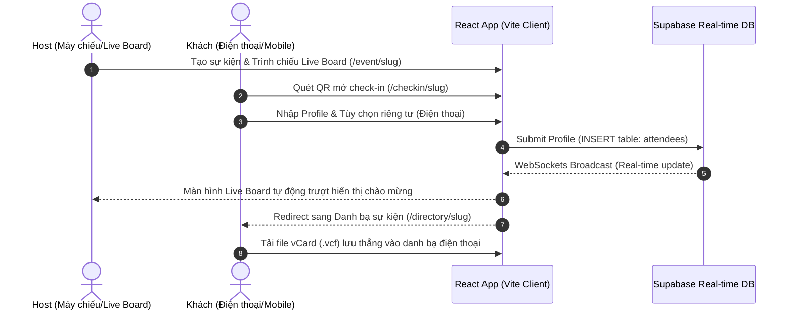

# ⭕ CircleLink - Mở Rộng Vòng Tròn Kết Nối (Meetup Networking App)

> **CircleLink** là một ứng dụng Web (SaaS) được tối ưu cho giao diện di động nhằm kết nối và lưu trữ thông tin liên lạc tức thời dành cho các buổi offline meetup, hội thảo hay họp nhóm.

Ứng dụng hiện tại đã được nâng cấp từ phiên bản tĩnh sang cấu trúc **Vite + React (JavaScript)** tích hợp **Supabase Database** hỗ trợ cơ chế đồng bộ thời gian thực (Real-time).

---

## 🗺️ Luồng hoạt động của Hệ thống



---

## ⚡ Tính năng nổi bật & Cấu trúc định tuyến (Routing)

Ứng dụng React hỗ trợ định tuyến phân lớp rõ ràng (Hash Routing để tối ưu khi chạy tĩnh hoặc local):

1.  **Trang chủ (`#/`)**: Cổng thông tin cho Host tạo sự kiện mới, nhập Tên, Mô tả và tự động sinh slug đường dẫn.
2.  **Màn hình trình chiếu (`#/event/:slug`)**: Hiển thị QR Code kích thước lớn và cập nhật dòng người tham gia check-in thời gian thực. Tích hợp thanh **Simulator** để chạy khách ảo thử nghiệm.
3.  **Trang quản trị của Host (`#/event/:slug/admin`)**: Cho phép Host sửa thông tin sự kiện, bật/tắt cổng check-in, bật/tắt bắt buộc nhập SĐT, **Kick (Xóa)** khách mời không hợp lệ, xuất danh sách check-in ra file **CSV (Excel)** và tải ảnh mã QR.
4.  **Cổng check-in của Khách (`#/checkin/:slug`)**: Form nhập profile kết nối kèm thiết lập riêng tư và lựa chọn avatar sinh động.
5.  **Danh bạ kết nối (`#/directory/:slug`)**: Danh sách toàn bộ mọi người trong sự kiện. Cho phép khách tìm kiếm, lọc theo vai trò, thả tim lưu những người quan tâm và tải file **vCard** lưu vào máy điện thoại nhanh chóng.

---

## ⚙️ Chế độ Kép thông minh (Dual-Mode Engine)

Ứng dụng hỗ trợ cơ chế chạy song song giúp bạn test nhanh không cần cài đặt hoặc kết nối server thực tế:

*   **Chế độ Supabase (Cloud Database):** Tự động kích hoạt khi bạn điền khóa API Supabase trong file `.env`. Dữ liệu sẽ được lưu trên database đám mây và đồng bộ xuyên suốt mọi thiết bị.
*   **Chế độ Demo (Fallback localStorage):** Tự động kích hoạt khi chưa có cấu hình `.env`. Dữ liệu check-in sẽ được lưu trữ cục bộ trong trình duyệt (`localStorage`) và đồng bộ real-time giữa các tab trong cùng trình duyệt qua cơ chế Window Event.

---

## 📂 Danh sách các file mã nguồn chính

*   [index.html](file:///Users/thanhnguyendo/Documents/SecondBrain/02-Projects/CircleO/index.html) - Trang khung HTML chính chứa thư viện icon FontAwesome và phông chữ Outfit/Plus Jakarta Sans.
*   [supabase_schema.sql](file:///Users/thanhnguyendo/Documents/SecondBrain/02-Projects/CircleO/supabase_schema.sql) - Script khởi tạo bảng `events`, `attendees` và kích hoạt Realtime trên Supabase.
*   [.env.example](file:///Users/thanhnguyendo/Documents/SecondBrain/02-Projects/CircleO/.env.example) - File mẫu hướng dẫn cấu hình kết nối Supabase Cloud.
*   [src/supabaseClient.js](file:///Users/thanhnguyendo/Documents/SecondBrain/02-Projects/CircleO/src/supabaseClient.js) - Script cấu hình và khởi tạo kết nối Supabase.
*   [src/services/eventService.js](file:///Users/thanhnguyendo/Documents/SecondBrain/02-Projects/CircleO/src/services/eventService.js) - Lớp dịch vụ trừu tượng hóa dữ liệu (Tự động chuyển đổi giữa Cloud DB và Local Storage).
*   [src/App.jsx](file:///Users/thanhnguyendo/Documents/SecondBrain/02-Projects/CircleO/src/App.jsx) - Cấu hình định tuyến các trang.
*   [src/index.css](file:///Users/thanhnguyendo/Documents/SecondBrain/02-Projects/CircleO/src/index.css) - File phong cách Obsidian Dark Mode toàn hệ thống.
*   [src/views/](file:///Users/thanhnguyendo/Documents/SecondBrain/02-Projects/CircleO/src/views/) - Các trang giao diện thành phần (Home, LiveBoard, HostAdmin, GuestCheckin, EventDirectory).

---

## 🚀 Hướng dẫn khởi chạy dự án React

Vite dev server đang chạy cục bộ tại cổng **5173**.

1.  **Mở ứng dụng trên trình duyệt:**
    👉 **[http://localhost:5173](http://localhost:5173)**
2.  **Khởi động lại Dev Server (nếu cần):**
    ```bash
    npm run dev
    ```
3.  **Hướng dẫn kết nối Supabase Cloud thực tế:**
    *   Tạo tài khoản miễn phí trên [Supabase](https://supabase.com).
    *   Tạo dự án mới, vào **SQL Editor** và paste nội dung file [supabase_schema.sql](file:///Users/thanhnguyendo/Documents/SecondBrain/02-Projects/CircleO/supabase_schema.sql) rồi nhấn **Run**.
    *   Tạo file `.env` ở thư mục gốc dự án (copy từ `.env.example`).
    *   Vào Supabase -> **Project Settings** -> **API** để lấy `Project URL` và `Anon Key` điền vào `.env`.
    *   Khởi chạy lại dự án. Hệ thống sẽ tự động đồng bộ lên Database Cloud!
